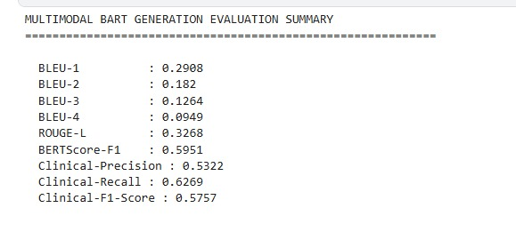
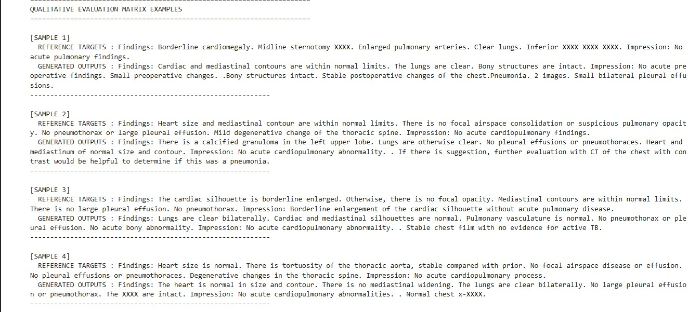

# 🩻 Chest X-ray Report Generation Using Multimodal Transformers

A multimodal deep learning framework for automated Chest X-ray report generation using visual feature extraction, multimodal representation learning, and transformer-based language generation.

## 📌 Overview

Automated Chest X-ray report generation is an important application of Artificial Intelligence in medical imaging. The objective is to generate clinically meaningful textual reports from Chest X-ray images while preserving relevant medical findings.

This project focuses on developing a multimodal deep learning framework for generating radiology-style reports from Chest X-ray images. The framework combines visual information from Chest X-ray images with transformer-based language generation to produce textual clinical reports.

The generated reports are evaluated using conventional Natural Language Generation metrics, semantic similarity metrics, and clinically oriented evaluation metrics.

## 🎯 Objectives

The main objectives of this project are:

- Generate automated textual reports from Chest X-ray images.
- Extract meaningful visual representations from medical images.
- Generate coherent medical descriptions using a transformer-based language model.
- Explore multimodal visual-textual representation learning.
- Evaluate generated reports using multiple Natural Language Generation metrics.
- Evaluate clinical information using precision, recall, and F1-score.
- Perform qualitative comparison between reference and generated reports.
- Analyze the strengths and limitations of automated medical report generation.

## 🧠 Proposed Approach

The overall workflow of the system is:

                  Chest X-ray Image
                         │
                         ▼
                Image Preprocessing
                         │
                         ▼
              Visual Feature Extraction
                         │
                         ▼
             Multimodal Representation
                         │
                         ▼
              BART-based Generation
                         │
                         ▼
              Generated Medical Report
                         │
                         ▼
                Multi-Metric Evaluation

The system processes Chest X-ray images to obtain meaningful visual representations. These representations are incorporated into the multimodal report-generation pipeline, which generates a textual clinical report.

The generated reports are then evaluated using both automated language-generation metrics and clinically oriented metrics.

## 🏗️ Model Components

The project consists of the following major components:

### 1. Image Preprocessing

Chest X-ray images are preprocessed before being passed to the visual feature extraction stage.

### 2. Visual Feature Extraction

Visual information from Chest X-ray images is converted into feature representations that capture relevant anatomical and pathological information.

### 3. Multimodal Feature Representation

Visual representations are incorporated into a multimodal framework to establish a connection between image information and natural language generation.

### 4. BART-based Report Generation

The BART transformer architecture is used as the language-generation component for producing textual medical reports.

### 5. Report Evaluation

The generated reports are evaluated using Natural Language Generation metrics, semantic similarity metrics, and clinical evaluation metrics.

## 📊 Dataset

The project uses the **IU Chest X-ray (IU-CXR)** dataset.

The IU-CXR dataset contains Chest X-ray images paired with corresponding radiology reports and is commonly used for research in automated medical report generation.

The dataset itself is not included in this repository because of its size and dataset access/distribution considerations

## 🛠️ Technologies Used

| Category                    | Technologies                         |
| --------------------------- | ------------------------------------ |
| Programming Language        | Python                               |
| Deep Learning               | PyTorch                              |
| Transformer Framework       | Hugging Face Transformers            |
| Report Generation           | BART                                 |
| Computer Vision             | Image Feature Extraction             |
| Data Processing             | NumPy, Pandas                        |
| Natural Language Processing | Transformers                         |
| Evaluation                  | BLEU, ROUGE-L, BERTScore             |
| Clinical Evaluation         | Clinical Precision, Recall, F1-Score |
| Visualization               | Matplotlib                           |
| Development Environment     | Kaggle                               |

## 🔄 System Workflow

Chest X-ray
    │
    ▼
Preprocessing
    │
    ▼
Visual Feature Extraction
    │
    ▼
Multimodal Feature Representation
    │
    ▼
Transformer-based BART Generator
    │
    ▼
Generated Radiology Report
    │
    ├───────────────┐
    ▼               ▼
Text Evaluation   Clinical Evaluation
    │               │
    ▼               ▼
BLEU              Precision
ROUGE-L           Recall
BERTScore         F1-Score

## 📈 Evaluation Metrics

The system is evaluated using multiple complementary metrics.

### Natural Language Generation Metrics

#### BLEU

BLEU measures the overlap between generated reports and reference reports using n-gram matching.

The project reports:

* BLEU-1
* BLEU-2
* BLEU-3
* BLEU-4

#### ROUGE-L

ROUGE-L evaluates similarity between generated and reference reports based on the Longest Common Subsequence.

#### BERTScore-F1

BERTScore evaluates semantic similarity between generated and reference reports using contextual representations.

### Clinical Metrics

The generated reports are additionally evaluated using:

* Clinical Precision
* Clinical Recall
* Clinical F1-Score

These metrics provide additional information about how effectively clinically relevant information is captured by the generated reports.

# 📊 Experimental Results

The final evaluation produced the following results:

| Metric             |      Score |
| ------------------ | ---------: |
| BLEU-1             | **0.2908** |
| BLEU-2             | **0.1820** |
| BLEU-3             | **0.1264** |
| BLEU-4             | **0.0949** |
| ROUGE-L            | **0.3268** |
| BERTScore-F1       | **0.5951** |
| Clinical Precision | **0.5322** |
| Clinical Recall    | **0.6269** |
| Clinical F1-Score  | **0.5757** |

### Evaluation Metrics

# 🔍 Qualitative Evaluation

Numerical metrics alone cannot completely represent the quality and clinical usefulness of automatically generated medical reports.

Therefore, qualitative evaluation was also performed by comparing generated reports with their corresponding reference reports.

The examples include multiple reference and generated report pairs and demonstrate how the model attempts to reproduce clinically relevant findings and impressions.

### Qualitative Results

## 📝 Qualitative Analysis

The qualitative examples demonstrate that the model is able to generate structured medical descriptions containing findings and impressions.

However, differences between the reference and generated reports can still occur. These differences may include:

* Missing clinical findings.
* Additional generated information.
* Different wording for similar findings.
* Differences in report structure.
* Incomplete reproduction of specific clinical details.

This highlights the importance of combining automated evaluation metrics with qualitative and clinical analysis.

## 🔬 Research Significance

Automated Chest X-ray report generation has the potential to support radiology workflows by reducing the effort required for routine documentation and assisting in the generation of preliminary reports.

However, medical report generation is significantly more challenging than general text generation because the generated text must preserve clinically relevant information and maintain factual consistency.

Therefore, this project evaluates the generated reports from multiple perspectives:

* **Lexical similarity**
* **Semantic similarity**
* **Clinical information preservation**
* **Qualitative report analysis**

This provides a broader evaluation of the report-generation system rather than relying on a single performance metric.

## ⚠️ Limitations

The current system has several limitations:

* Generated reports may contain clinically plausible but incorrect statements.
* Exact phrase matching remains challenging, as reflected by the BLEU scores.
* Medical terminology and long-range clinical dependencies are difficult to model.
* Automated metrics cannot completely measure clinical correctness.
* A generated report may differ from the reference report while still conveying similar information.
* Clinical validation by expert radiologists would provide a stronger assessment of real-world usefulness.
* The current evaluation is based on the available experimental dataset and setup.

---

## 🚀 Future Work

Potential directions for future improvement include:

* Using larger and more diverse medical imaging datasets.
* Improving multimodal feature fusion.
* Exploring stronger medical-domain language models.
* Improving factual consistency of generated reports.
* Reducing hallucinated clinical findings.
* Incorporating multi-view Chest X-ray images.
* Incorporating additional clinical information.
* Applying stronger explainability techniques.
* Performing expert-based clinical evaluation.
* Comparing different transformer architectures for medical report generation.

